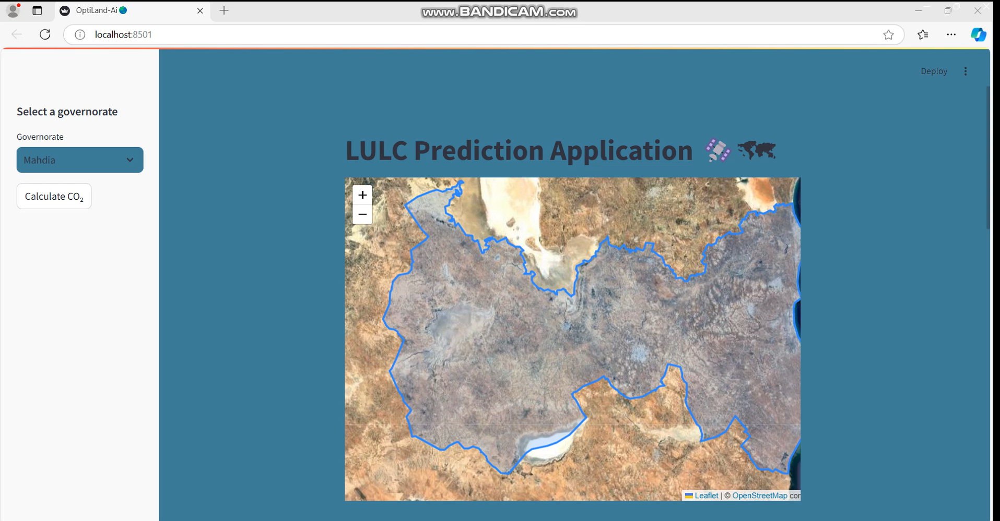
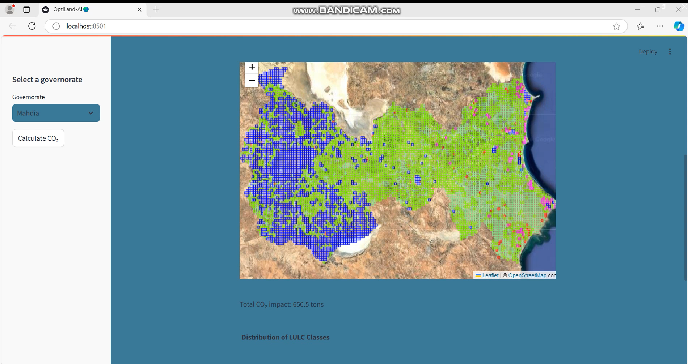

# Satellite-Based Monitoring System for Land Use and Land Cover Changes for Sustainable Development 🌍


## Table of Contents
- [Introduction](#introduction)
- [Features](#features)
- [Application Workflow](#application-workflow)
- [LULC Classes and CO₂ Impact Rates](#lulc-classes-and-co-impact-rates)
- [Technologies Used](#technologies-used)
- [Demo](#demo)
- [Dataset](#dataset)
- [Installation](#installation)
- [How to Run](#how-to-run)
- [Team](#team)
- [License](#license)
- [Acknowledgements](#acknowledgements)

## Introduction
This repository contains an AI-based platform designed to classify **Land Use and Land Cover (LULC)** from **Sentinel-2 satellite imagery**. The platform is developed as part of the [Hack4Earth Hackathon](https://hack4earth.org), focusing on sustainable environmental solutions through AI. **OptiLand-Ai** is an AI-powered web application for LULC prediction using satellite imagery. The app allows users to select a province, view satellite imagery, and predict LULC classes while also calculating the CO₂ impact based on different land covers. This tool is particularly useful for environmental monitoring and sustainability analysis.

## Features
- **LULC Prediction**: Utilizes a pre-trained ResNet50 model to predict various LULC classes such as forests, residential areas, industrial areas, and more.
- **Satellite Image Visualization**: Displays satellite imagery of selected provinces with overlaid predictions using Folium.
- **CO₂ Impact Calculation**: Estimates the total CO₂ impact based on the predicted land use classes.
- **Interactive Map**: Integrates Folium and Streamlit for an interactive experience, including map layers and LULC class legends.
- **Class Distribution**: Visualizes the distribution of predicted LULC classes through a bar chart, breaking down their CO₂ impact.

### Application Workflow
1. **Select a Province**: Use the sidebar to choose one of the available provinces (e.g., Tunis, Monastir).
2. **View Satellite Imagery**: The app will load and display satellite images for the selected province.
3. **LULC Prediction**: The app automatically generates grid tiles over the selected region and predicts LULC classes for each tile.
4. **CO₂ Calculation**: Optionally, click the "Calculate CO₂" button to estimate the CO₂ impact of the predicted land classes.

### LULC Classes and CO₂ Impact Rates
| LULC Class              | Color            | CO₂ Impact (tons) |
|------------------------|------------------|--------------------|
| AnnualCrop             | Light Green      | 2.5                |
| Forest                 | Forest Green     | -20                |
| HerbaceousVegetation    | Yellow Green     | -5                 |
| Highway                | Gray             | 10                 |
| Industrial             | Red              | 50                 |
| Pasture                | Medium Sea Green  | 1.5               |
| PermanentCrop          | Chartreuse       | -3                 |
| Residential            | Magenta          | 15                 |
| River                  | Dodger Blue      | 0                  |
| SeaLake                | Blue             | 0                  |

## Technologies Used
- **Streamlit**: For creating the web interface.
- **PyTorch**: For loading and running the pre-trained ResNet50 model.
- **Earth Engine (EE)**: For initializing and processing satellite imagery.
- **Geopandas & Rasterio**: For working with geospatial data and raster images.
- **Folium**: For map visualization.
- **Plotly**: For generating interactive plots and charts.

## Demo
[Download the Demo Video](assets/LUCD.mp4)




## Dataset

The dataset used in this study is the EuroSAT dataset, which contains 27,000 labeled 64x64 pixel Sentinel-2 satellite image patches across 10 different Land Use Land Cover (LULC) categories: 'AnnualCrop', 'Forest', 'HerbaceousVegetation', 'Highway', 'Industrial', 'Pasture', 'PermanentCrop', 'Residential', 'River', and 'SeaLake'. Both RGB and multi-spectral (MS) images are available for download. For our project, we will focus on RGB image classification.

**Dataset available:** [EuroSAT Dataset](https://zenodo.org/records/7711810#.ZAm3k-zMKEA)

## Installation
### Clone the Repository
To clone the repository, use the following command:
```bash
git clone https://github.com/FadwaHarrabi/Hack4Earth-OptiLand-Ai.git
```

### Install Requirements
Install all the dependencies required to run the app:
```bash
pip install -r requirements.txt
```

## How to Run
To run the Streamlit app, execute the following command:
```bash
streamlit run app.py
```

## Team
- **Team Leader**: Wadie Kadri
- **Team Member**: Fadwa Harrabi

## License
This project is licensed under the MIT License.

## Acknowledgements
- Google Earth Engine for providing satellite data.
- PyTorch for the deep learning framework.
- Streamlit for simplifying web app development.

For more details, check the authors' profiles:
- [Kadri Wadie](https://www.linkedin.com/in/kadri-wadie?lipi=urn%3Ali%3Apage%3Ad_flagship3_profile_view_base_contact_details%3BfMVI6fNCQxmvDpQs993TCg%3D%3D)
- [Fadwa Harrabi](https://www.linkedin.com/in/fadwa-harrabi-546746259?lipi=urn%3Ali%3Apage%3Ad_flagship3_profile_view_base_contact_details%3BjyZm9EJlTUyR6%2FB2xhEzBg%3D%3D)
